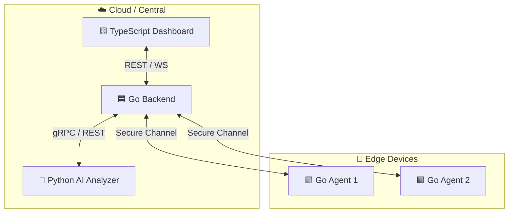

<div align="center">

# 🛡️ Edge-Aware Cybersecurity Orchestrator

**Intelligent Edge Threat Detection & Device Orchestration System**

*A distributed, edge-first security platform where devices participate in their own defense.*

[](https://go.dev)
[](https://www.python.org)
[](https://www.typescriptlang.org)
[](https://www.docker.com)
[](#-license)

</div>

---

## 📑 Table of Contents

- [Overview](#-overview)
- [Core Components](#-core-components)
- [Architecture](#️-architecture)
- [Installation & Setup](#-installation--setup)
  - [For End Users](#for-end-users-installers)
  - [For Developers](#for-developers-docker-compose)
- [Project Structure](#️-project-structure)
- [Security & Edge Design](#-security--edge-design)
- [Database Schema](#-database-schema)
- [Roadmap](#️-roadmap)
- [Author](#-author)

---

## 📖 Overview

**Edge-Aware Cybersecurity Orchestrator** is a distributed system designed to detect, analyze, and respond to potential threats in real time across connected devices.

It represents a modern **edge-first architecture** — rather than routing every byte of telemetry to a central server for analysis, edge devices process and pre-filter their own data, only escalating meaningful signals upward. This reduces latency, preserves bandwidth, and keeps sensitive data closer to its source.

---

## 🧩 Core Components

| Component | Language | Role |
|---|---|---|
| 🟦 **Orchestrator** (Backend) | Go | The command center — manages device registration, command dispatch, and threat intelligence aggregation. |
| 🟩 **Edge Agent** | Go | A lightweight service running on edge devices — collects telemetry and executes secure, signed commands. |
| 🐍 **AI Analyzer** | Python | A machine-learning engine that flags anomalies in real-time telemetry streams. |
| 🟨 **Dashboard** (Client) | TypeScript / React | A global network visualization and alert-management interface. |

---

## ⚙️ Architecture



The Dashboard communicates with the Backend over REST and WebSockets for live updates. The Backend forwards telemetry to the AI Analyzer for anomaly detection, then relays verified threat intelligence and signed commands to each Agent over a secure channel.

---

## 🚀 Installation & Setup

You can install the Edge Agent using a professional installer, or run the entire stack via Docker Compose.

### For End Users (Installers)

If you just want to run the Agent on a device, grab the latest build from the **[Releases page](https://github.com/tekluabayneh/Edge-Aware-Cybersecurity-Orchestrator/releases)**.

<table>
<tr>
<td width="50%" valign="top">

**🪟 Windows**

Download `Agent_Setup_amd64.exe` and run the installer. It sets up the service and configures permissions automatically.

</td>
<td width="50%" valign="top">

**🐧 Linux (Ubuntu / Debian)**

Download `agent_1.0.x_amd64.deb`, then install:

```bash
sudo dpkg -i agent_1.0.x_amd64.deb
```

</td>
</tr>
</table>

> The Linux installer automatically configures `/var/lib/agent-orchestrator/` with the write permissions required for telemetry storage.

### For Developers (Docker Compose)

To run the full ecosystem — Backend, Analyzer, Agent, and Dashboard — in one command:

```bash
# Clone the repository
git clone https://github.com/tekluabayneh/Edge-Aware-Cybersecurity-Orchestrator.git
cd Edge-Aware-Cybersecurity-Orchestrator

# Spin up the entire stack
docker-compose up --build
```

| Service | URL |
|---|---|
| 🟦 Orchestrator API | `http://localhost:8080` |
| 🐍 AI Analyzer | `http://localhost:8000` |
| 🟨 Dashboard UI | `http://localhost:5173` |

---

## 🗂️ Project Structure

```
Edge-Aware-Cybersecurity-Orchestrator/
├── agent/           # Go source for the edge service
├── backend/         # Go source for the orchestrator and database logic
├── analyzer/        # Python scripts for threat detection logic
├── client/          # React/Vite dashboard source
├── scripts/         # Post-install automation for Linux environments
└── installer.iss    # Inno Setup configuration for Windows production builds
```

---

## 🔒 Security & Edge Design

- **Zero-Config Permissions** — Windows and Linux installers handle filesystem permissions automatically, allowing the Agent to store JWT tokens securely without manual setup.
- **Whitelisted Execution** — Agents only execute backend-signed commands, preventing remote code execution (RCE) from unauthorized sources.
- **Data Sovereignty** — Telemetry is processed locally on-device before being summarized and forwarded to the orchestrator.

---

## 🧠 Database Schema

The detailed schema and entity relationships are available here:

🔗 **[View Database Schema →](https://drawsql.app/teams/man-21/diagrams/edage-aware-security-db/embed)**

---

## 🗺️ Roadmap

- [ ] macOS Agent installer
- [ ] Multi-tenant orchestration support
- [ ] Expanded anomaly-detection models
- [ ] Alert-routing integrations (Slack, PagerDuty, email)

---

## 🧑‍💻 Author

**Teklu Abayneh**
*Cybersecurity Enthusiast · Full-Stack Engineer · Edge Systems Engineer*

[](https://github.com/tekluabayneh)

---

<div align="center">

*Built with ⚙️ Go, 🐍 Python, and 🟨 TypeScript — securing the edge, one device at a time.*

</div>
